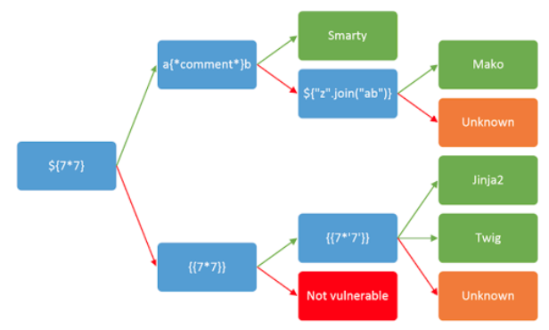

# SSTI

> Server-side template injection is when an attacker is able to use native template syntax to inject a malicious payload into a template, which is then executed server-side.

### Payloads

```
{{7*7}} 
${7*7} 
%{7*7} 
<%=7*7%> 
${{7*7}} 
#{7*7} 
%25{5*5}
```

If evaluated as **49**, target can be vulnerable to XSS or even RCE.

### Identify template engine in use

Once a SSTI is found, we must identify which template engine is being used. For this, we can use the following [PortSwigger](https://portswigger.net/research/server-side-template-injection) methodology:



### Automation

LIke sqlmap for SQL Injection, we can use [tplmap](https://github.com/epinna/tplmap) to automate the exploitation of SSTI.&#x20;


